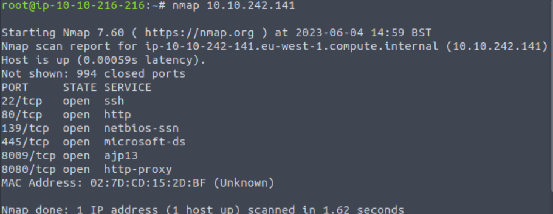
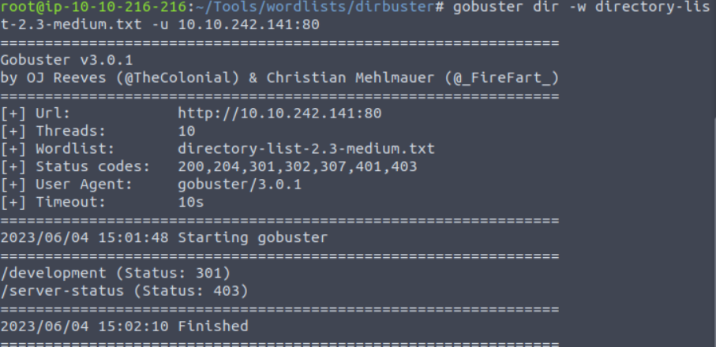
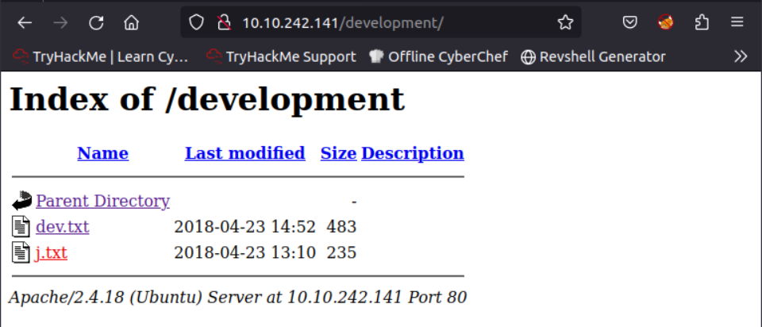
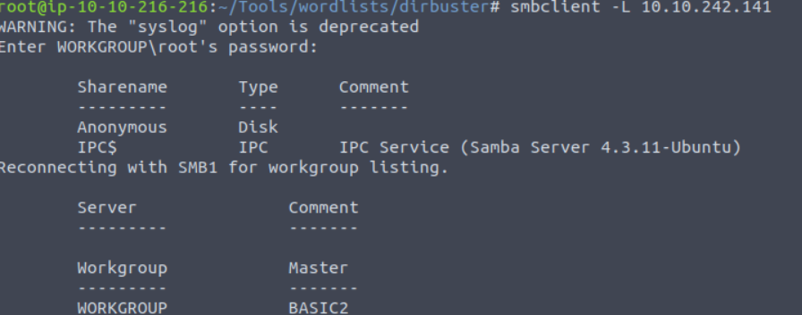
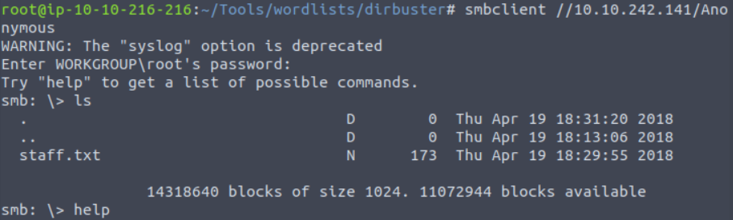
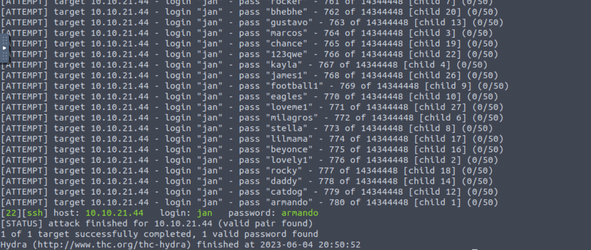
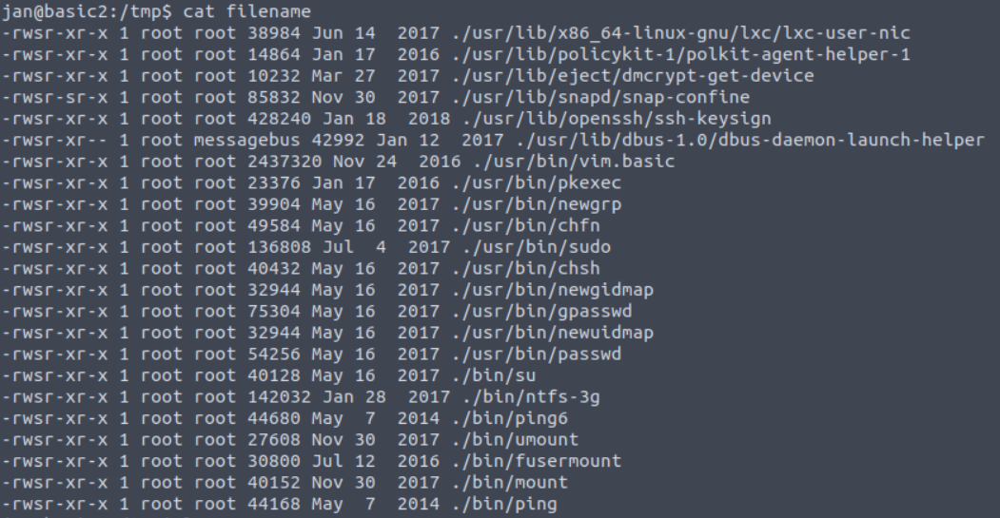
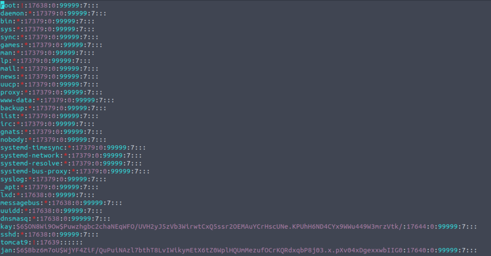
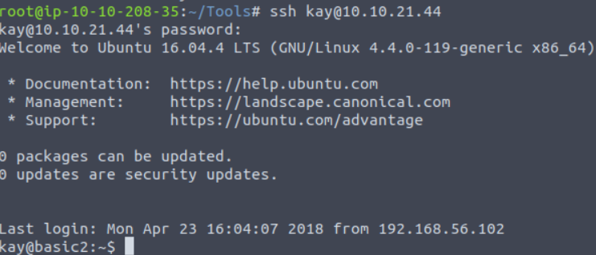
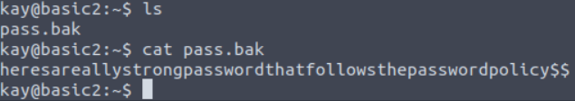

# **Basic Pentesting**

---

## **Reco**

nmap:



on voit un site et plusieurs port ouvert

- 22: ssh
- 80: le site
- 139 : netbios-ssn Ce service permet d'échanger des messages en mode connecté jusqu'à 131071 octets
- 445: Il s'agit du protocole SMB ( Service Message Block) utilisé pour le partage des fichiers et utilise le port 445 en TCP.
- 8009: ajp13 AJP is a wire protocol. It an optimized version of the HTTP protocol to allow a standalone web server such as Apache to talk to Tomcat
- 8080: http proxy

---

## **80**



en utilisant gobuster sur le port 80 on voit une directory /development



on voit plusieurs .txt

dev.txt :

```txt
2018-04-23: I've been messing with that struts stuff, and it's pretty cool! I think it might be neat
to host that on this server too. Haven't made any real web apps yet, but I have tried that example
you get to show off how it works (and it's the REST version of the example!). Oh, and right now I'm
using version 2.5.12, because other versions were giving me trouble. -K

2018-04-22: SMB has been configured. -K

2018-04-21: I got Apache set up. Will put in our content later. -J
```

Ici on apprend que laversion qu'ils utilisent est la 2.5.12 (pour le REST ?)

j.txt :

```txt
For J:

I've been auditing the contents of /etc/shadow to make sure we don't have any weak credentials,
and I was able to crack your hash really easily. You know our password policy, so please follow
it? Change that password ASAP.

-K
```

ici on voit que le hash est facilement craqueable qui on arrive a y avoir acces

---

## **445**

on liste ce qu'il y a d'accessible sans mot de passe



on voit anonymous et IPC

(resultat peut etre obtenu avec ***enum4linux***)



on voit qu'il existe un staff.txt

contenue de staff.txt:

```txt
Announcement to staff:

PLEASE do not upload non-work-related items to this share. I know it's all in fun, but
this is how mistakes happen. (This means you too, Jan!)

-Kay
```

## **22**

avec tout les informations a notre dispositions essayons un brute force de la sessions ssh de jan car on sait que sont mdp est facilement bruteforcable

avec cette commande hydra:

```bash
hydra -V -l jan -P rockyou.txt -f 10.10.21.44 ssh -t 32
```

-V c'est le verbeux

-l le login ici il est statique

-P la wordlist avec les password

-f quitte lorsque un match a été trouvé

ssh le type de connexion

-t le nombre de thread (plus y'en a plus ca va vite)

apres l'avoir laisser turner 1 minute ou 2 on obtient



le mot de passe est ``armando``

---

## **escalation de privilege**

une fois connectée en ssh on se rend compte que ce user n'a pas beaucoup de privilege

on va donc chercher une faille SUIDavec cette commande

```bash
find . -user root -perm -4000 -exec ls -ldb {} \; >/tmp/filename
```

-user root: Displays files owned only by root.

-perm -4000: Displays files only with permissions set to 4000. (SUID)

-exec ls -ldb: Displays the output of the find command in ls -ldb format.

>/tmp/filename: Writes results to this file.

on obtient:



dans tout ces fichier on en voit un qui peut nous servir c'est le ./usr/bin/vim.classic

qui donne les privilege root a vim

en d'autre terme il est possible de modifier et de consulter tout les fichier texte auxquelles nous avons acces.

par exemple ./etc/shadow



``$6$ON8Wi9Ow$Puwzhgbc2chaNEqWFO/UVH2yJ5zVb3WirwtCxQ5ssr2OEMAuYCrHscUNe.KPUhH6ND4CYx9WWu449W3mrzVtk/``

le hash de kay

on remplace ce hash la avec le hash de jan que l'on connais deja et on teste une connexion SSH



nous avons reussi a nous connecter a kay avec le mdp de jan



ici on récupere le flag

``heresareallystrongpasswordthatfollowsthepasswordpolicy$$``

---

## **Conclusion**

Box numéro: **2**

Temps pour le faire: ~3h

Point de blocage:

- je n'ai pas penser a utiliser du brute force
- j'etais un peu perdu avec samba et comment utiliser et lire enum4linux
- j'aurais du reflechir plus a toute les informations que j'avais pour avancer plus vite
- je pense avoir eu de la chance avec mon find perm SUID parce que je n'avais pas d'outils du style LinEnum ou linpeas
- avec ce genre d'outils j'aurais pu voir qu'il y avait la clé privé ssh de kay et j'aurais pu acceder a sa sessions sans modifier shadow
- j'aurais du aller fouiller dans le .ssh dans le user kay
