# **Rootme**

---

## **Reco**

nmap:

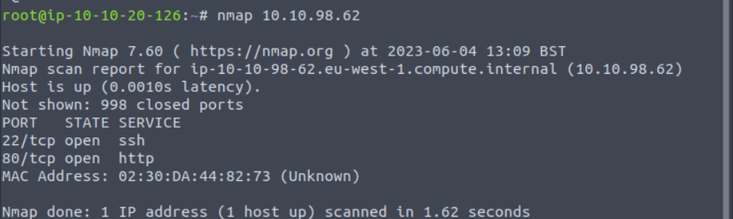

on voit un port http et ssh

on se connecte au port avec netcat

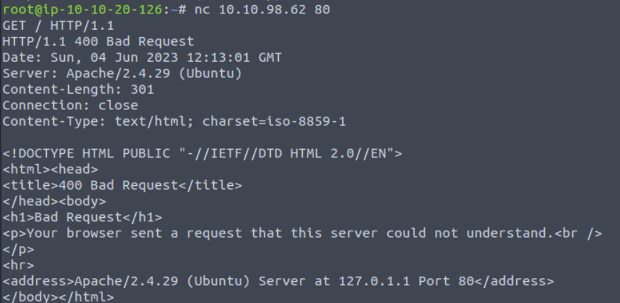

on voit que le server est apache 2.4.29

gobuster:

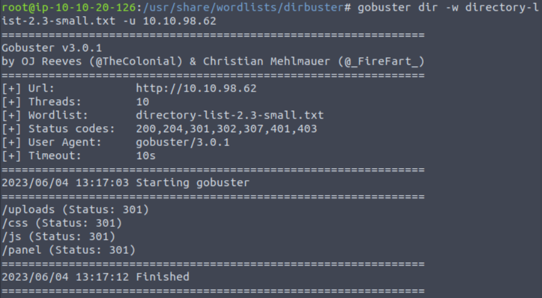

on voit un path /panel

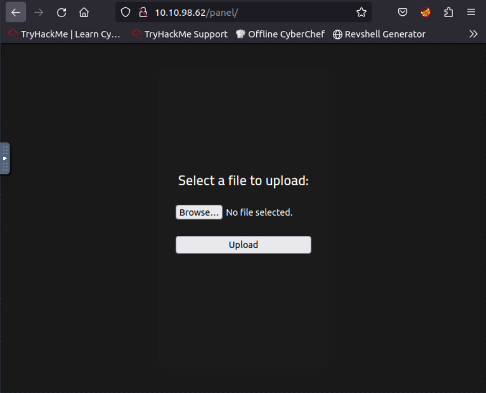

ici on voit un champ pour upload un fichier

## **Reverse Shell**

mettons en plae un reverse shell

nc listen :

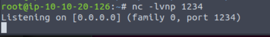

on ecoute sur un de nos port essayons d'envoyer un payload de reverse shell php par le systeme d'envoie de fichier

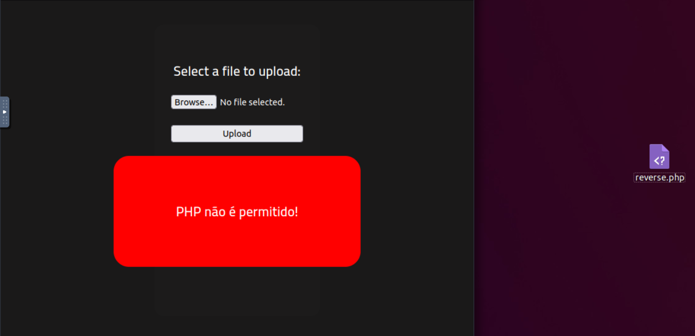

comme on peut le voir il n'accepte pas les fichier PHP

essayer de changer le nom du fichier ou de changer le header du fichier dans la requete HTTP.

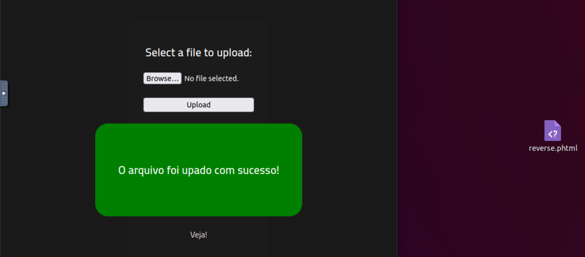

avec un nom de fichier qui execute du php comme phtml on arrive a upload le fichier

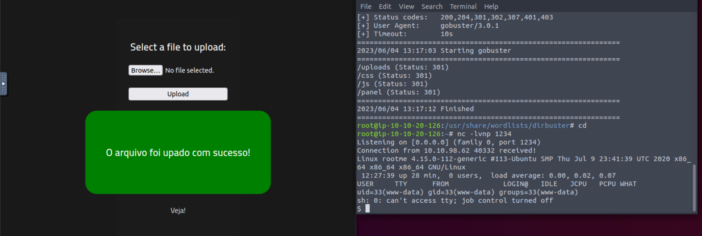

losrsque l'on clique sur Veja! notre payload s'atcive et le reverse est en place.

on doit maitenant aler chercher le flag dans user.txt

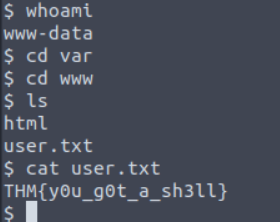

en utilisant la commande ``whoami`` on voit que le user s'appelle www-data.

allons donc dans le directory var/www et comme on peut le voir il y a bien le flag !

## **Escalation de privilege**

on doit trouver un fichier ayant une permission SUID donc on utilise la commande suivante dans ./usr

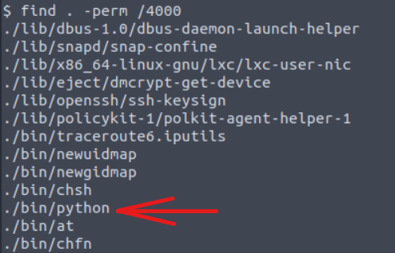

python est bizarre

comme python a des permission SUID du user root cela veut dire que les commandes python seront éxécutées en tant que root.

avec le payload de gtfobins

```python
./python -c 'import os; os.execl("/bin/sh", "sh", "-p")'
```

on ouvre un shell mais comme on l'ouvre avec python il nous donne les privileges root.

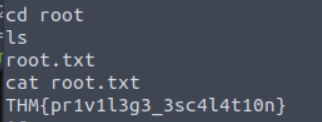

on trouve donc dans le dossier root le flag root.txt

On trouve le flag : ***THM{pr1v1l3g3_3sc4l4t10n}***

---

## **Conclusion**

Box numéro: **1**

Temps pour le faire: ~3h

Point de blocage:

- je ne savais pas comment fonctionnais un reverse shell
- je ne savais pas ce qu'etait un SUID permission
- je savais pas ce qu'etait un filebypass
