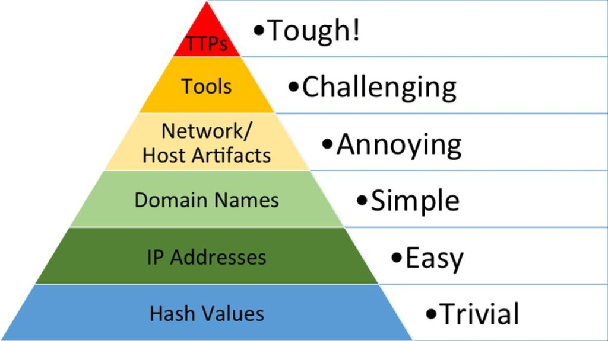

# Pyramid of Pain

## Hash values - Trivial

Hash is a numeric value that uniquely identifies data

Exemple :
- MD5 not secure
- SHA-1 not secure
- SHA-2 secure

Security usually use the hash values to gain insight into a specific malware sample

Tools like VirusTotal help identify malicious file through ther hash

It is not reliable for a IOC (indicator of compromise) since the hash can easily be changed if only a single bit is different

## IP Adress - Easy

From a defense standpoint, knowledge of the IP addresses an adversary uses can be valuable. A common defense tactic is to block, drop, or deny inbound requests from IP addresses on your parameter or external firewall

Although the attacker can change their IP to circumvent this usiing Fast Flux

Fast Flux is a DNS technique to hide behind compromised hosts (botnet)
