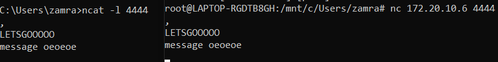
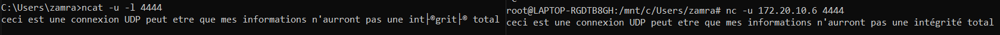

# **Connection TCP/UDP**

---

J'ai essayé d'établir une connection TCP entre mon WSL et mon bash sous windows.

En utilisant netcat sous windows j'ouvre un port en écoute avec cette commande :

```bash
    C:\Users\zamra>ncat -l 4444
```


Puis avec le bash de mon WSL je me suis connecter a ce port avec cette commande:

```bash
root@LAPTOP-RGDTB8GH:/mnt/c/Users/zamra# nc 172.20.10.6 4444
```


En rouge il s'agit de l'IP de ma machine Windows a ce moment la.

Grace a ca j'ai pu établir une connexion TCP entre ces deux ordinateurs.



## **UDP**

Idem pour UDP seulement on rajoute le switch -u dans chaque commande.

Voici le résultat:


