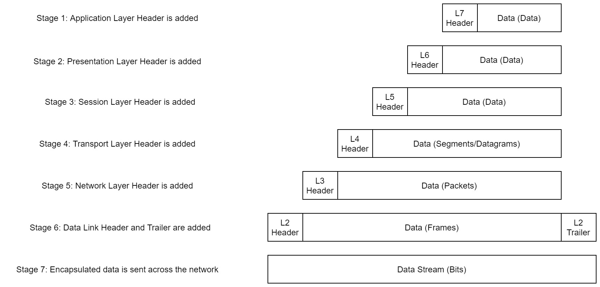
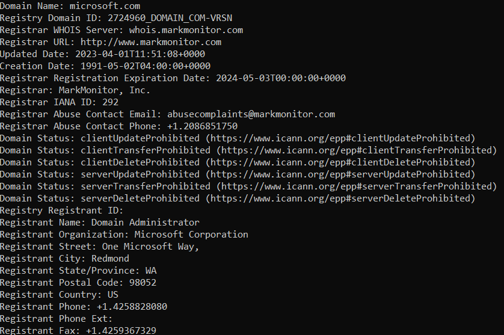
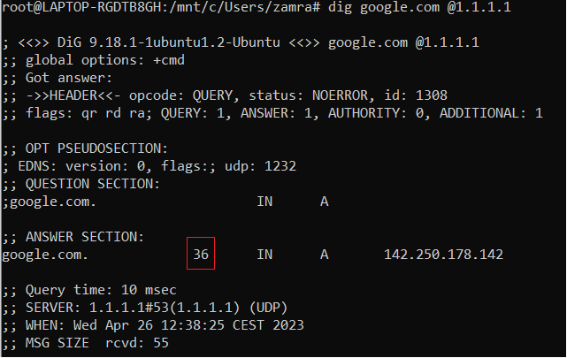

# Networking

---

## Introduction

The topics that we're going to cover in this room are:

- The OSI Model
- The TCP/IP Model
- How these models look in practice
- An introduction to basic networking tools

---

## OSI Model

| OSI |
|:----:|
| 7 Application |
| 6 Presentation |
| 5 Session |
| 4 Transport |
| 3 Network |
| 2 Data Link |
| 1 Physical |

7- Application : Sort of an interface

6- Presentation : Gets Data from Application & translates it into standardised language

5- Session : Create a unique link to another computer/server

4- Transport : Chooses the protocol to use. (Most common are TCP/UDP)

    TCP : Connection Based (reliable transmission) - Segments
    UDP : Used for speed/ no connection is established(data integrity doesn't matter) - Datagrams

3- Network : Locating the destination of your request(finding the IPv4 adress)

2- Data Link : Physical adressing (Network is software). It receives the packet from Transport and adds MAC adress (unique to a physical component)

1- Physical : Hardware

---

## Encapsulation



---

## TCP/IP


### Three way Handshake


---

## Commands

### Traceroute

Traceroute can be used to map the path your request takes as it heads to the target machine.

``` bash
    traceroute google.com
```

### WHOIS

Whois essentially allows you to query who a domain name is registered to.

``` bash

whois microsoft.com
```


### Dig

Searches for a specific domain name ona specific DNS (Domain Name System)

```bash
dig <domain> @<dns-server-ip>
```

It gets you a lot of info such as TTL (Time To Live). It's the amount of time (in seconds) your computer will keep the association.



Here the TTL is 36 secondes

When searching for an association your computer sends the query first to a recursive DNS server that will find the bedst suited DNS to answer the query.