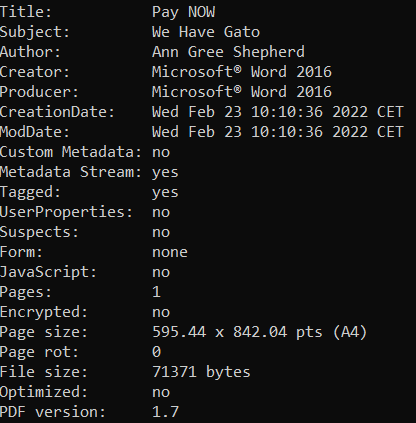
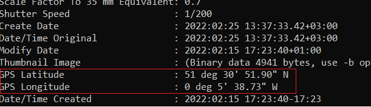
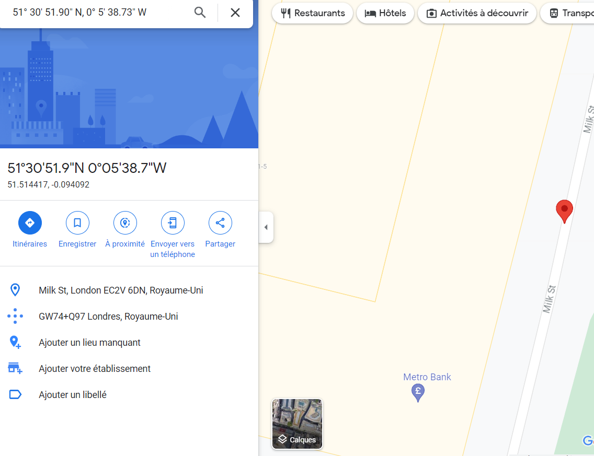
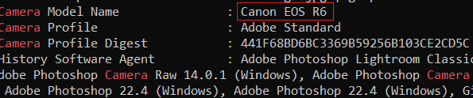

# **Intro to Digital Forensic**

---

Forensics is the application of science to investigate crimes and establish facts.

---

## **Digital Forensics Process**

the basic plan goes as follows:

| Etape | Description              |
|:--------------|:------------------:|
|Acquire the evidence| Collect the digital devices such as laptops, storage devices, and digital cameras.|
|Establish a chain of custody|The purpose is to ensure that only the authorized investigators had access to the evidence and no one could have tampered with it.|
|Place the evidence in a secure container|You want to ensure that the evidence does not get damaged|
|Transport the evidence to your digital forensics lab.|X|

Then at the lab:

| Etape |
|:--------------|
|Retrieve the digital evidence from the secure container.|
|Create a forensic copy of the evidence|
|Return the digital evidence to the secure container|
|Start processing the copy on your forensics workstation.|

More generally,

| Etape | Description              |
|:--------------|:------------------:|
|Proper search authority|Investigators cannot commence without the proper legal authority.|
|Chain of custody|This is necessary to keep track of who was holding the evidence at any time.|
|Validation with mathematics|Using a special kind of mathematical function, called a hash function, we can confirm that a file has not been modified.|
|Use of validated tools|The tools used in digital forensics should be validated to ensure that they work correctly.|
|Repeatability|The findings of digital forensics can be reproduced as long as the proper skills and tools are available.|
|Reporting|The digital forensics investigation is concluded with a report that shows the evidence related to the case that was discovered.|

---

## **Practical Exemple**

My cat Gato has been stolen and a ransom has been demanded.


Using forensics i need to find the author of this heinous crime!

I will be inspecting the metadata of the pdf that has been given to me using

```bash
pdfinfo ransom-letter.pdf
```

we get this output:



We can see that the author is Ann Gree Sheperd!

**There is also an image joined withthe letter !**

Whenever you take a photo with your smartphone or with your digital camera, plenty of information gets embedded in the image. The following are examples of metadata that can be found in the original digital images:

- Camera model / Smartphone model
- Date and time of image capture
- Photo settings such as focal length, aperture, shutter speed, and ISO settings

Using `exiftool` we will retrieve the metadata of the picture

```bash
exiftool letter-image.jpg
```



It gives us a lot of information and among them there are the GPS coordinates

When we search them in a map search engine we get :



The picture has been taken in Milk Street

Also usin this command we can get the type of camera used.

```bash
exiftool letter-image.jpg | grep Camera
```



Here the model is Canon EOS R6.
