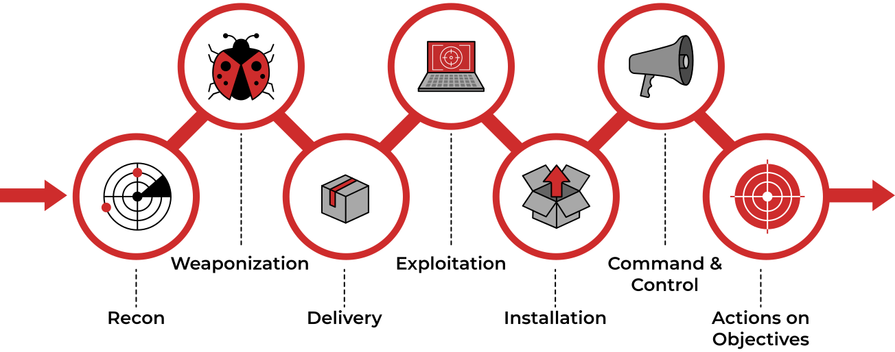

# **Network Security**

---

## **Introduction**

A computer network is a group of computers and devices connected with each other.

Network security focuses on protecting the security of these devices and the links connecting them.

Examples of hardware appliances include:

- Firewall appliance: The firewall allows and blocks connections based on a predefined set of rules.

- Intrusion Detection System (IDS) appliance: An IDS detects system and network intrusions and intrusion attempts.

- Intrusion Prevention System (IPS) appliance: An IPS blocks detected intrusions and intrusion attempts.

- Virtual Private Network (VPN) concentrator appliance: A VPN ensures that the network traffic cannot be read nor altered by a third party.

On the other hand, we have software security solutions. Common examples are:

- Antivirus software
- Host firewall (not hardware)

---

## **Methodology**



Breaking into a target network usually includes a number of steps. According to Lockheed Martin, the Cyber Kill Chain has seven steps:

| Etape | Description              |
|:-------------|:------------------:|
|Recon| Recon, short for reconnaissance, refers to the step where the attacker tries to learn as much as possible about the target. |
|Weaponisation|preparing a file with a malicious component, for example, to provide the attacker with remote access.|
|Delivery| Delivery means delivering the “weaponized” file to the target via any feasible method(Email/USB...)|
|Exploitation| When the user opens the malicious file, their system executes the malicious component.|
|Installation|The previous step should install the malware on the target system.|
|Command & Control (C2)|Installation of the malware provides the attacker with a command and control ability over the target system.|
|Actions on Objectives|After gaining control over one target system, the attacker has achieved their objectives.|

---

## **Practical exemple**

### **Recon**

we can speed up our reconnaissance activities using different tools that gather information about the various aspects related to the target.

Nmap is a network scanner that helps us discover running machines and any programs running on them that are visible to the outside world.


Next we connect to target FTP server

After guessing `anonymous` as the name we have access to the server and check what files there are here by typing `ls`


There is a secret.txt file.

We display it by doing `cat secret.txt` command in terminal and we get

```bash
    password: ABC789xyz123
```

We then try to connect to the computer using SSH with this command: `ssh root@<ip-adress>`

A password will be required but fortunately we have just found it.

then we have to output the flag.txt using `cat flag.txt`