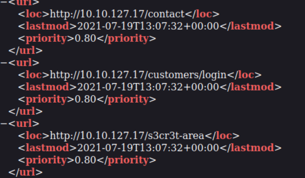
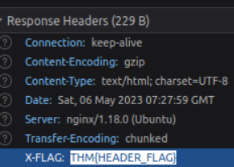

# **Content Discovery**

---

## **Introduction**

When we talk about content discovery, we're not talking about the obvious things we can see on a website; it's the things that aren't immediately presented to us and that weren't always intended for public access.

There are three main ways of discovering content on a website which we'll cover. Manually, Automated and OSINT (Open-Source Intelligence).

---

## **Manual Discovery**

### **Robot.txt**

The robots.txt file is a document that tells search engines which pages **they are and aren't allowed** to show on their search engine results or ban specific search engines from crawling the website altogether.

This file gives us a great list of locations on the website that the owners don't want us to discover as penetration testers.

### **Favicon**

The favicon is a small icon displayed in the browser's address bar or tab used for branding a website.

Sometimes when frameworks are used to build a website, a favicon that is part of the installation gets leftover, and if the website developer doesn't replace this with a custom one, this can give us a clue on what framework is in use.

```bash
curl https://static-labs.tryhackme.cloud/sites/favicon/images/favicon.ico | md5sum
```

In this practical exemple and with [this database](https://wiki.owasp.org/index.php/OWASP_favicon_database.) we can compare the hash the command gives us to the framework favicondatabase and find out the framework.

### **Sitemap.xml**

Unlike the robots.txt file, which restricts what search engine crawlers can look at, the sitemap.xml file gives a list of every file the website owner wishes to be listed on a search engine.



In the practical exemple we see a path called s3cr3t-area!

### **HTTP Headers**

When we make requests to the web server, the server returns various HTTP headers.



Looking at a header we can gather a lot of useful information.

### **Framework Stack**

Once you've established the framework of a website you can then locate the framework's website.

From there, we can learn more about the software and other information, possibly leading to more content we can discover.

---

## **OSINT**

There are also external resources available that can help in discovering information about your target website; these resources are often referred to as OSINT or (Open-Source Intelligence) as they're freely available tools that collect information

### **Google Hacking / Dorking**

Google hacking / Dorking utilizes Google's advanced search engine features, which allow you to pick out custom content.

| Filter   | Exemple            | Description                                                  |
| -------- | ------------------ | ------------------------------------------------------------ |
| site     | site:tryhackme.com | returns results only from the specified website address      |
| inurl    | inurl:admin        | returns results that have the specified word in the URL      |
| filetype | filetype:pdf       | returns results which are a particular file extension        |
| intitle  | intitle:admin      | returns results that contain the specified word in the title |

### **Wappalyzer**

[Wappalyzer](https://www.wappalyzer.com/) is an online tool and browser extension that helps identify what technologies a website uses, such as frameworks, Content Management Systems (CMS), payment processors and much more, and it can even find version numbers as well.

### **Wayback Machine**

[The Wayback Machine](https://archive.org/web/) is a historical archive of websites that dates back to the late 90s. You can search a domain name, and it will show you all the times the service scraped the web page and saved the contents. This service can help uncover old pages that may still be active on the current website.

### **S3 Buckets**

S3 Buckets are a storage service provided by Amazon AWS, allowing people to save files and even static website content in the cloud accessible over HTTP and HTTPS.

The format of the S3 buckets is `http(s)://{name}.s3.amazonaws.com`

---

## **Automated Discovery**

Automated discovery is the process of using tools to discover content rather than doing it manually.

This process is made possible by using a resource called wordlists.

Wordlists are just text files that contain a long list of commonly used words.

Using gobuster:

```bash
gobuster dir --url http://10.10.127.17/ -w /usr/share/wordlists/SecLists/Discovery/Web-Content/common.txt
```

ffuf, dirb and gobuster.
