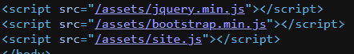
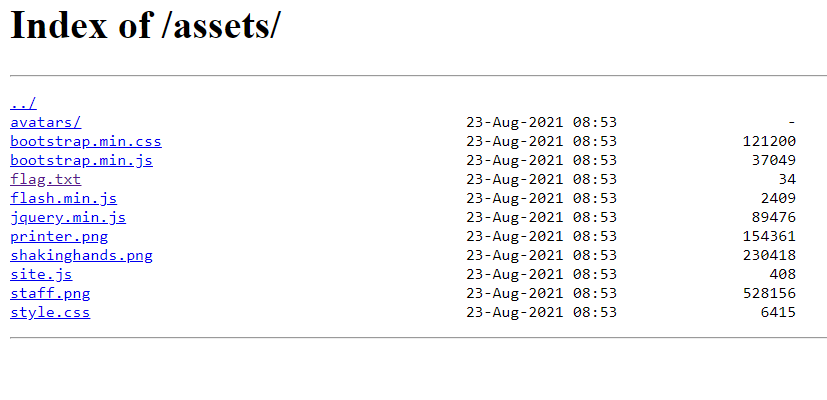
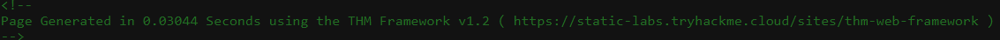
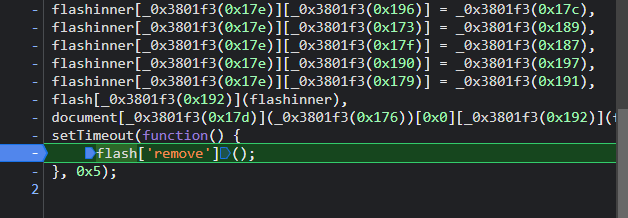
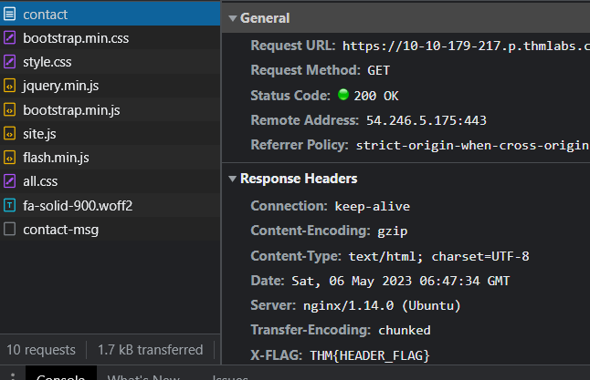
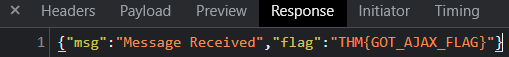

# **Walking An Application**

---

## **Introduction**

in-built browser tools:

- View Source - Use your browser to view the human-readable source code of a website.
- Inspector - Learn how to inspect page elements and make changes to view usually blocked content.
- Debugger - Inspect and control the flow of a page's JavaScript
- Network - See all the network requests a page makes.

---

## **View Source**

Directory listing :

Here we can see the /assets

If we access it we get :

Also we can exploit patched vulnerabilities in frameworks if the framework is not updated on the website.

For exemple:

By goingon the framework website we can see the new version is 1.3 and they have fixed some vulnerabilities.

So in this website we will be able to exploit them.

---

## **Developper tools: Inspect**

You can inspect specific parts of a web page and chage its values as you see fit.

---

## **Developper tools: Debugger**

By placing a breakpoint in the javascript code, it allows it to stop wherever we'd like.

Here we put a breakpoint at a moment where a **critical** information is being shown so we can see it.

---

## **Developper tools: Network**

We can see the specific querys beetween the computer and the website in the network tab.

Much like Wireshark.

Here the flag i snot the one we are looking for the one we need is in the Response tab

