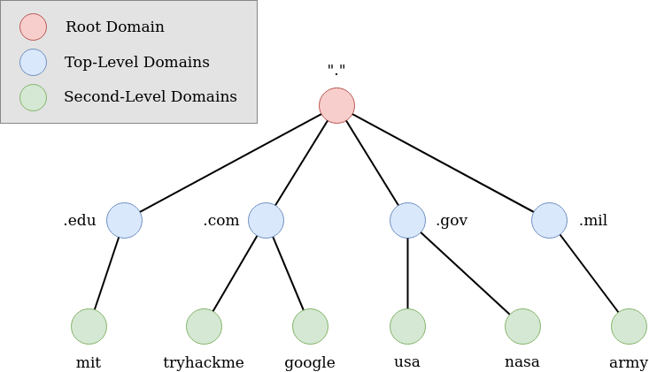
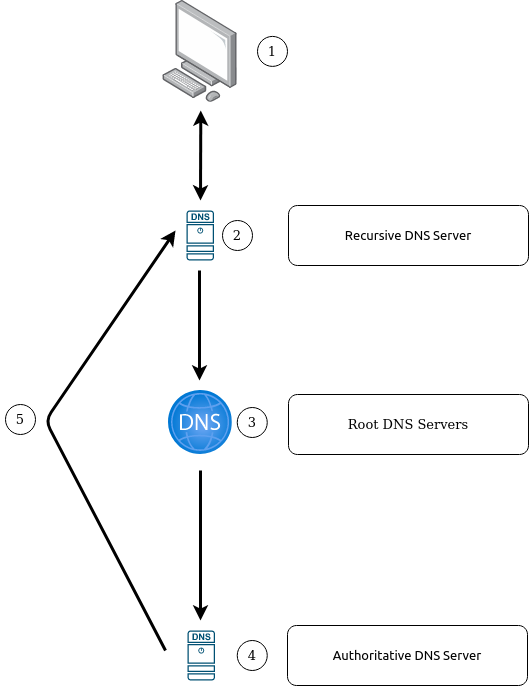

# **DNS in Detail**

---

## **Introduction**

DNS (Domain Name System) provides a simple way for us to communicate with devices on the internet without remembering complex numbers

---

## **Domain Hierarchy**

### **Top Level Domain (TLD)**

A TLD is the most righthand part of a domain name.

There are two types of TLD, **gTLD** (Generic Top Level) and **ccTLD** (Country Code Top Level Domain).

### **Second Level Domain**

It's the part on the left. For instance, *google*.com: 'google' is the Second Level Domain

When registering a domain name, the second-level domain is limited to 63 characters + the TLD and can only use a-z 0-9 and hyphens.

### **Subdomain**

A subdomain sits on the left-hand side of the Second-Level Domain using a period to separate it

For instance *ece*.campusonline.me. Here *ece* is the subdomain.

A subdomain name is limited to 63 characters + the TLD and can only use a-z 0-9 and hyphens.

---

## **Record Types**

DNS isn't just for websites though, and multiple types of DNS record exist.

### **A Record**

These records resolve to IPv4 addresses.

### **AAAA Record**

These records resolve to IPv6 addresses.

### **CNAME Record**

These records resolve to another domain name. Example: store.tryhackme.com which returns a CNAME record shops.shopify.com.

Another DNS request would then be made to shops.shopify.com to work out the IP address.

### **MX Record**

These records resolve to the address of the servers that handle the email for the domain you are querying

### **TXT Record**

TXT records are free text fields where any text-based data can be stored.

TXT records have multiple uses, but some common ones can be to list servers that have the authority to send an email on behalf of the domain

---

## **Making a request**

### **Step 1**

When you request a domain name, your computer first checks its local cache.

If not found a request to your Recursive DNS Server will be made.

### **Step 2**

The Recursive DNS server also has a local cache of recently looked up domain names.

If the request cannot be found locally, a journey begins to find the correct answer, starting with the internet's root DNS servers.

### **Step 3**

The root servers act as the DNS backbone of the internet; it redirects you to the correct Top Level Domain Server(TLD), depending on your request.

### **Step 4**

The TLD server holds records for where to find the authoritative server to answer the DNS request

The authoritative server is often also known as the nameserver for the domain.

### **Step 5**

An authoritative DNS server is the server that is responsible for storing the DNS records for a particular domain name and where any updates to your domain name DNS records would be made.

Depending on the record type, the DNS record is then sent back to the Recursive DNS Server, where a local copy will be cached for future requests and then relayed back to the original client that made the request.

 

