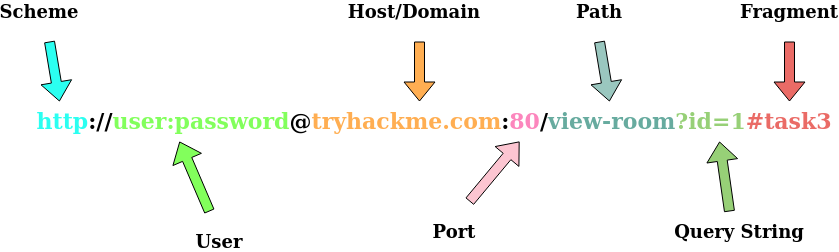
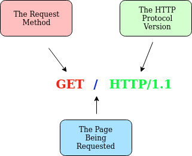

# **HTTP in Detail**

---

## **Introduction**

HTTP is what's used whenever you view a website.

HTTP is the set of rules used for communicating with web servers for the transmitting of webpage data, whether that is HTML, Images, Videos, etc.

HTTPS is the secure version of HTTP.

HTTPS data is encrypted.

---

## **Requests and Response**

When we access a website, your browser will need to make requests to a web server for assets

Before that, you need to tell the browser specifically how and where to access these resources

### **What is a URL? (Uniform Resource Locator)**

 

| Feature      | Description                                                      |
| ------------ | ---------------------------------------------------------------- |
| Scheme       | This instructs on what protocol to use                           |
| User         | Some services require authentication to log in                   |
| Host         | The domain name or IP address of the server                      |
| Port         | The Port that you are going to connect to                        |
| Path         | Location of the resource you are trying to access                |
| Query String | Extra bits of information that can be sent to the requested path |
| Fragment     | This is a reference to a location on the actual page requested   |

### **Making a Request**

It's possible to make a request to a web server with just one line **"GET / HTTP/1.1"**

---

## **HTTP Methods**

HTTP methods are a way for the client to show their intended action when making an HTTP request.

| Request | Description                                                         |
| ------- | ------------------------------------------------------------------- |
| GET     | Used for getting information from a web server                      |
| POST    | Used for submitting data to the web server and creating new records |
| PUT     | Used for submitting data to a web server to update information      |
| DELETE  | Used for deleting information/records                               |

---

## **HTTP STATUS CODE**

| Code Range | Response             | Description                                                                                      |
| ---------- | -------------------- | ------------------------------------------------------------------------------------------------ |
| 100-199    | Information Response | First part of their request has been accepted                                                    |
| 200-299    | Success              | request successful.                                                                              |
| 300-399    | Redirection          | Redirect the client's request to another resource. To a different webpage or a different website |
| 400-499    | Client Errors        | Used to inform the client that there was an error with their request.                            |
| 500-599    | Server Errors        | Errors happening on the server-side                                                              |

---

## **Headers**

Headers are additional bits of data you can send to the web server when making requests.

### **Common Request Headers**

**Host**: Some web servers host multiple websites so by providing the host headers you can tell it which one you require

**User-Agent**: This is your browser software and version number, telling the web server your browser software helps it format the website properly for your browser.

**Content-Length**: the content length tells the web server how much data to expect in the web request

**Accept-Encoding**: Tells the web server what types of compression methods the browser supports

**Cookie**: Data sent to the server to help remember your information

### **Common Response Headers**

**Set-Cookie**: Information to store which gets sent back to the web server on each request

**Cache-Control**: How long to store the content of the response in the browser's cache before it requests it again.

**Content-Type**: What type of data is being returned, i.e., HTML, CSS, etc...

**Content-Encoding**: Method that has been used to compress the data

---

## **Cookies**

Small piece of data that is stored on your computer. Cookies are saved when you receive a "Set-Cookie" header from a web server.

Then every further request you make, you'll send the cookie data back to the web server.

Cookies can be used for many purposes but are most commonly used for website authentication.
