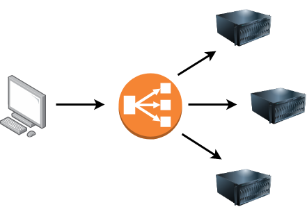

# **Putting it All Together**

---

## **Other Components**

### **Load Balencer**

When a website's traffic starts getting quite large or is running an application that needs to have high availability, one web server might no longer do the job.

Load balancers provide two main features:

- ensuring high traffic websites can handle the load
- providing a failover if a server becomes unresponsive

Load balancers also perform periodic checks with each server to ensure they are running correctly; this is called a health check.

### **CDN (Content Delivery Networks)**

A CDN can be an excellent resource for cutting down traffic to a busy website.

It allows you to host static files from your website, such a JavaScript, CSS, Images, Videos, and host them across thousands of servers all over the world

### **Databases**

Often websites will need a way of storing information for their users.

Webservers can communicate with databases to store and recall data from them.

Databases can range from just a simple plain text file up to complex clusters of multiple servers providing speed and resilience.

### **WAF (Web Application Firewall)**

WAF sits between your web request and the web server.

Its primary purpose is to protect the webserver from hacking or denial of service attacks.

---

## **How Web servers work**

### **WebServer**

A web server is a software that listens for incoming connections and then utilises the HTTP protocol to deliver web content to its clients.

A Web server delivers files from what's called its root directory, which is defined in the software settings.

### **Virtual Hosts**

Web servers can host multiple websites with different domain names; to achieve this, they use virtual hosts.

The web server software checks the hostname being requested from the HTTP headers and matches that against its virtual hosts.

Virtual Hosts can have their root directory mapped to different locations on the hard drive.

### **Static Vs Dynamic Content**

Static content, as the name suggests, is content that never changes.

Dynamic content, on the other hand, is content that could change with different requests.

These changes to what you end up seeing are done in what is called the Backend.

### **Scripting and Backend Languages**

There's not much of a limit to what a backend language can achieve, and these are what make a website interactive to the user.

These languages can interact with databases, call external services, process data from the user, and so much more.
