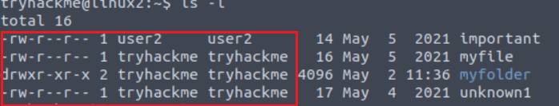

# **Linux Fundamentals**

- Unlocking the potential of your first few commands by introducing you to using flags and arguments
- Advancing your knowledge of the filesystem to perform some more useful commands such as copying and moving files
- Introducing you to the access mechanisms in place to keep files and folders secure and how to identify the things that our current user has access too
Running your first few scripts and executables!

---

## **SSH**

This protocol is called Secure Shell or SSH for short and is the common means of connecting to and interacting with the command line of a remote Linux machine.

### **What is SSH & how Does it Work?**

Secure Shell or SSH simply is a protocol between devices in an encrypted form.

```bash
ssh <hostname>@<ip>
```

---

## **Filesystem Interaction Continued**

| Command | Full Name      | Purpose                      |
| ------- | -------------- | ---------------------------- |
| touch   | touch          | Create file                  |
| mkdir   | make directory | Create a folder              |
| cp      | copy           | Copy a file or folder        |
| mv      | move           | Move a file or folder        |
| rm      | remove         | Remove a file or folder      |
| file    | file           | Determine the type of a file |

---

## **Permissions 101**

Using the command `ls -l` we get :



A file or folder can have a couple of characteristics that determine both what actions are allowed and what user or group has the ability to perform the given action -- such as the following:

- Read
- Write
- Execute

In the screenshot we see that there is a user2

We connect to it using `su user2` command.

The great thing about Linux is that permissions can be so granular, that whilst a user technically owns a file, if the permissions have been set, then a group of users can also have either the same or a different set of permissions to the exact same file without affecting the file owner itself.

---

## **Common Direcories**

### **/etc**

This root directory is one of the most important root directories on your system.

The etc folder (short for etcetera) is a commonplace location to store system files that are used by your operating system.

### **/var**

The "/var" directory, with "var" being short for variable data,  is one of the main root folders found on a Linux install.

This folder stores data that is frequently accessed or written by services or applications running on the system.

### **/root**

Unlike the /home directory, the /root folder is actually the home for the "root" system user.

There isn't anything more to this folder other than just understanding that this is the home directory for the "root" user.

### **/tmp**

This is a unique root directory found on a Linux install.

Short for "temporary", the /tmp directory is volatile and is used to store data that is only needed to be accessed once or twice.

Similar to the memory on your computer, once the computer is restarted, the contents of this folder are cleared out.

What's useful for us in pentesting is that any user can write to this folder by default.
