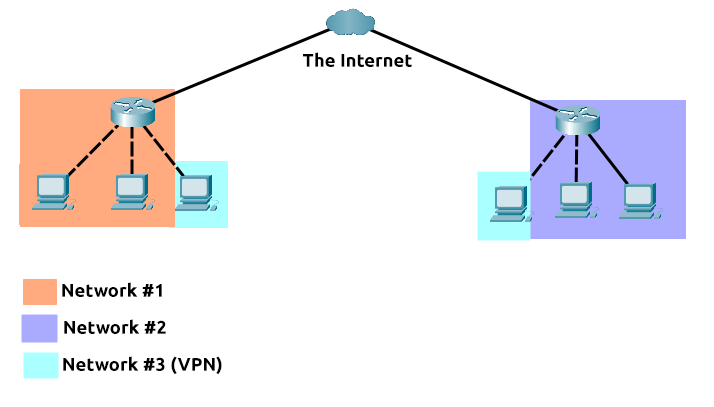

# **Extending Your Network**

---

## **Introduction to Port Forwarding**

Port forwarding is an essential component in connecting applications and services to the Internet.

Without port forwarding, applications and services such as web servers are only available to devices within the same direct network.

---

## **Firewalls 101**

A firewall is a device within a network responsible for determining what traffic is allowed to enter and exit.

Think of a firewall as border security for a network. An administrator can configure a firewall based on numerous factors such as:

- Where the traffic is coming from?
- Where is the traffic going to?
- What port is the traffic for?
- What protocol is the traffic using?

Firewalls come in all shapes and sizes. From dedicated pieces of hardware to residential routers or software

| Firewall Category | Description                                                                                                                                                                                                                                                                                                                                                                                                                                |
| ----------------- | ------------------------------------------------------------------------------------------------------------------------------------------------------------------------------------------------------------------------------------------------------------------------------------------------------------------------------------------------------------------------------------------------------------------------------------------ |
| Stateful          | Rather than inspecting an individual packet, this firewall determines the behaviour of a device based upon the entire connection.  This firewall type consumes many resources in comparison to stateless firewalls as the decision making is dynamic. For example, a firewall could allow the first parts of a TCP handshake that would later fail.   If a connection from a host is bad, it will block the entire device. |
| Stateless         | This firewall type uses a static set of rules to determine whether or not individual packets are acceptable or not.  Whilst these firewalls use much fewer resources than alternatives, they are much dumber. For example, these firewalls are only effective as the rules that are defined within them.  However, these firewalls are great when receiving large amounts of traffic from a set of hosts                   |

---

## **VPN Basics**

A **V**irtual **P**rivate **N**etwork (**VPN**) is a technology that allows devices on separate networks to communicate securely by creating a dedicated path between each other over the Internet (known as a tunnel).

Devices connected within this tunnel form their own private network.

The devices connected on Network #3 are still a part of Network #1 and Network #2 but also form together to create a private network (Network #3) that only devices that are connected via this VPN can communicate over.

Other benefits offered by a VPN:

| Benefit                                                             | Description                                                                                                                                                                                                           |
| ------------------------------------------------------------------- | --------------------------------------------------------------------------------------------------------------------------------------------------------------------------------------------------------------------- |
| Allows networks in different geographical locations to be connected | A business with multiple offices will find VPNs beneficial, as it means that resources like servers/infrastructure can be accessed from another office.                                                               |
| Offers privacy                                                      | VPN technology uses encryption to protect data. The data is not vulnerable to sniffing  This encryption is useful in places with public WiFi, where no encryption provided by the network.                    |
| Offers anonyminity                                                  | Usually, your traffic can be viewed by your ISP and other intermediaries and therefore tracked.   The level of anonymity a VPN provides is only as much as how other devices on the network respect privacy.. |

Existing VPN technologies:

| Technology | Description |
| ---------- | ----------- |
|PPP|This technology is used by PPTP to allow for authentication and provide encryption of data. Using a private key and public certificate. A private key & certificate must match for you to connect.  This technology is not capable of leaving a network by itself|
|PPTP|Point-to-Point Tunneling Protocol (PPTP) allows the data from PPP to travel and leave a network.   PPTP is very easy to set up. However it's weakly encrypted in comparison to alternatives.|
|IPSec|Internet Protocol Security (IPsec) encrypts data using Internet Protocol (IP) framework.  IPSec is difficult to set up in comparison to alternatives. However, if successful, it boasts strong encryption|

---

## **Lan Networking Device**

It's a router's job to connect networks and pass data between them

Routing involves creating a path between networks so that this data can be successfully delivered.

Routers operate at Layer 3 of the OSI model.

A switch is a dedicated networking device responsible for providing a means of connecting to multiple devices

A layer 2(Data Link) switch will forward frames onto the connected devices using their MAC address.

A layer 3(Network) switch can perform some of the responsibilities of a router. Namely, these switches will send frames to devices and route packets to other devices using the IP protocol.

A technology called VLAN (Virtual Local Area Network) allows specific devices within a network to be virtually split up.

his split means they can all benefit from things such as an Internet connection but are treated separately.
