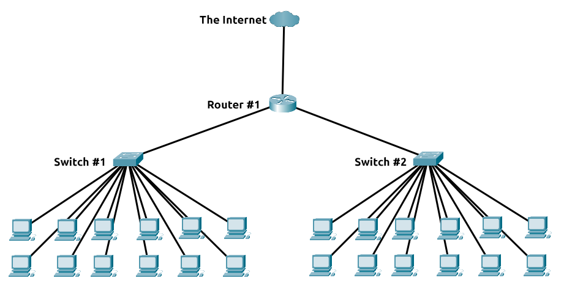

# **Intro To LAN**

---

## **Local Area Network (LAN) Topologies**

when we refer to the term "topology", we are actually referring to the design or look of the network at hand.

### **Star Topology**

The main premise of a star topology is that devices are individually connected via a central networking device such as a switch or hub.

Any information sent to a device in this topology is sent via the central device to which it connects.

Because more cabling & the purchase of dedicated networking equipment is required for this topology, it is more ***expensive*** than any of the other topologies.

This topology is much more ***scalable*** in nature, which means that it is very easy to add more devices as the demand for the network increases.

The more the network scales, the more maintenance is required to keep the network functional. This increased ***dependence on maintenance*** can also make ***troubleshooting faults much harder***.

### **Bus Topology**

This type of connection relies upon a single connection which is known as a ***backbone*** cable.

Because all data destined for each device travels along the same cable, it is very quickly prone to becoming ***slow and bottlenecked*** if devices within the topology are simultaneously requesting data.

Very ***difficult troubleshooting*** because it quickly becomes difficult to identify which device is experiencing issues with data all travelling along the same route.

Bus topologies are one of the easier and more ***cost-efficient*** topologies to set up because of their expenses, such as cabling or dedicated networking equipment used to connect these devices.

### **Ring Topology**

Devices such as computers are connected directly to each other to form a ***loop***, meaning that there is little cabling required and less dependence on dedicated hardware such as within a star topology.

A ring topology works by sending data across the loop until it reaches the destined device, using other devices along the loop to forward the data.

Because there is only one direction for data to travel across this topology, it is fairly ***easy to troubleshoot*** any faults that arise

Ring topologies are less prone to ***bottlenecks*** as large amounts of traffic are not travelling across the network at any one time.

The design of this topology does, however, mean that a fault such as cut cable, or broken device will result in the ***entire networking breaking***.

### **What is a Switch**

Switches are dedicated devices within a network that are designed to aggregate multiple other devices such as computers, printers, or any other networking-capable device using ethernet.

Both Switches and Routers can be connected to one another. The ability to do this ***increases the redundancy*** (the reliability) of a network by adding multiple paths for data to take.

If one path goes down, ***another can be used***.

### **What is a Router?**

It's a router's job to connect networks and pass data between them.

It does this by using ***routing***.

Routing involves creating a path between networks so that this data can be successfully delivered.

---

## **A Primer on Subnetting**

Subnetting is achieved by splitting up the number of hosts that can fit within the network, represented by a number called a subnet mask.

An IP address is made up of four sections called octets. The same goes for a subnet mask which is also represented as a number of four bytes (32 bits), ranging from 0 to 255 (0-255).

Subnets use IP addresses in three different ways:

- Identify the network address
- Identify the host address
- Identify the default gateway

| Type            | Purpose                                                      | Explanation                                                                                                                            | Example       |
| --------------- | ------------------------------------------------------------ | -------------------------------------------------------------------------------------------------------------------------------------- | ------------- |
| Network Address | Identifies the start of the actual network                   | Used to identify a network's existence                                                                                                 | 192.168.1.0   |
| Host Address    | Used to identify a device on the subnet                      | An IP address is assigned to a device on the subnet                                                                                    | 192.168.1.100 |
| Default Gateway | Special address assigned to a device capable of sending data | Used to send information to another network. Any data that needs to go to a device on a different network will be sent to this device. | 192.168.1.254 |

Subnetting provides a range of benefits, including:

- Efficiency
- Security
- Full control

---

## **ARP Protocol**

Devices can have two identifiers: A ***MAC*** address and an ***IP*** address, the ***ARP protocol*** or **A**ddress **R**esolution **P**rotocol for short, is the technology that is responsible for allowing devices to identify themselves on a network.

The ARP protocol allows a device to associate its MAC address with an IP address on the network.

When devices wish to communicate with another, they will send a broadcast to the entire network searching for the specific device.

### **How does ARP work**

Each device within a network has a **cache** to store information.

This cache stores the **identifiers** of other devices on the network.

The ARP protocol sends two types of messages:

1. ARP Request: message is broadcasted to every other device found on a network
2. ARP Reply: the device does have the requested IP address, an ARP reply is returned to the initial device to acknowledge this

---

## **DHCP Protocol**

IP addresses can be assigned either manually, by entering them physically into a device, or automatically and most commonly by using a ***DHCP*** (**D**ynamic **H**ost **C**onfiguration **P**rotocol) server.

| Step          |                           Description                           |
| ------------- | :-------------------------------------------------------------: |
| DHCP Discover |    To see if any DHCP servers are on the network.(no IP yet)    |
| DHCP Offer    |      Replies back with an IP address the device could use       |
| DHCP Request  |    The device then sends a reply confirming it wants the IP     |
| DHCP ACK      | DHCP server sends a reply acknowledging this has been completed |

