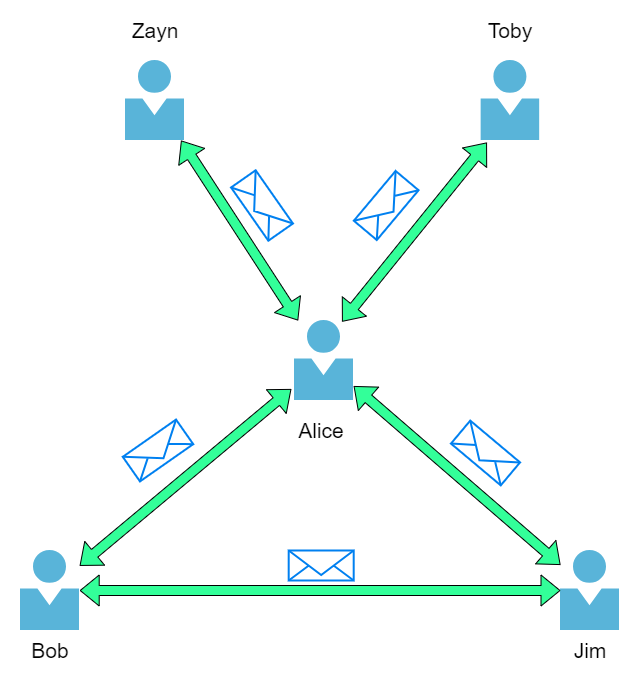
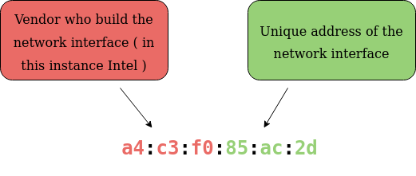

# **What is Networking ?**

---

## **Introduction**

Networks are simply things connected.

In computing, networking is the same idea, just dispersed to technological devices.

In computing, a network can be formed by anywhere from 2 devices to billions. These devices include everything from your laptop and phone to security cameras, traffic lights and even farming!

Alice is the only person who speaks the same language as Zayn and Toby. So Alice will have to be the messenger!

Because Alice can speak both languages, they can communicate to one another through Alice — forming a new network.

Let's relate Alice's network of friends to computing devices. The Internet looks like a much larger version of this sort of diagram:

---

## **Identifying Devices on a Network**

Devices have two means of identification, with one being permeable. These are:

- An IP Address

- A Media Access Control (MAC) Address -- think of this as being similar to a serial number.

### **IP Adresses**

An IP address is a set of numbers that are divided into four octets.

Addresses can change from device to device but cannot be active simultaneously more than once within the same network.

IP Addresses follow a set of standards known as protocols.

Public IP addresses are given by your Internet Service Provider (or ISP)

As more and more devices become connected, it is becoming increasingly harder to get a public address that isn't already in use.

### **Mac Adresses**

Devices on a network will all have a physical network interface, which is a microchip board found on the device's motherboard.

The MAC address is a twelve-character hexadecimal number

However, an interesting thing with MAC addresses is that they can be faked or "spoofed" in a process known as spoofing.

This spoofing occurs when a networked device pretends to identify as another using its MAC address.

---

## **Ping (ICMP)**

Ping is one of the most fundamental network tools available to us.

Ping uses ICMP (Internet Control Message Protocol) packets to determine the performance of a connection between devices
